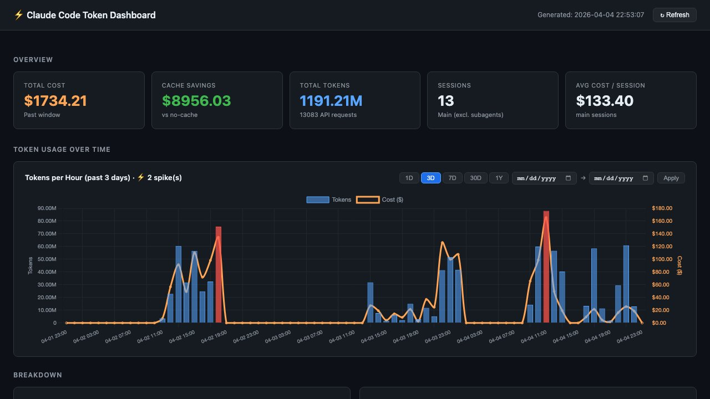

# Claude Code Token Dashboard

A local Python script that reads Claude Code usage logs and generates a fully interactive cost + usage dashboard in your browser. No account needed. No data leaves your machine.



## What It Shows

- **Total cost, cache savings, token count, session count** — at a glance
- **Token usage over time** — interactive bar chart with 1D / 3D / 7D / 30D / 1Y views and a custom date range picker
- **Cost by model** — Opus, Sonnet, and Haiku usage side by side
- **Task type breakdown** — coding, planning, debugging, research, and more
- **Spike & compaction events** — anomalous hours (detected with 2σ threshold) and context compaction events, with per-event details
- **Sessions table** — every session sorted by cost, expandable to show the top 5 most expensive requests and what Claude was actually doing
- **Terminology glossary** — definitions of session, request, cache savings, spike, and compaction

## Why It Exists

Claude Code's built-in `/cost` command tells you total spend after the fact — nothing more. There's no timeline, no session breakdown, no model split, and no way to see which tasks are burning the most tokens. This dashboard fills that gap.

## Input

The script reads `~/.claude/projects/**/*.jsonl` — the standard Claude Code usage logs that are written automatically as you work. No additional configuration needed.

**Key fields extracted:**
- `type: "assistant"` → model, input/output/cache tokens, timestamp
- `type: "user"` → task descriptions (first message per session)
- `type: "system", subtype: "compact_boundary"` → context compaction events

**Sample log structure (simplified):**
```jsonl
{"type":"assistant","timestamp":"2026-04-04T10:00:00Z","sessionId":"abc123","message":{"model":"claude-opus-4-6","usage":{"input_tokens":12500,"output_tokens":800,"cache_creation_input_tokens":0,"cache_read_input_tokens":45000}}}
{"type":"user","timestamp":"2026-04-04T10:00:01Z","sessionId":"abc123","message":{"content":[{"type":"text","text":"Refactor the auth module to use JWT"}]}}
```

## Output

A self-contained `dashboard.html` file (~100KB) that opens automatically in your default browser. All data is embedded — no server required, the file works offline.

**Sample output values (from a real session):**

| Metric | Example |
|--------|---------|
| Total cost | $1,734.21 |
| Cache savings | $8,956.03 |
| Total tokens | 1,191M |
| Sessions | 13 |
| Avg cost/session | $133.40 |

*(Private session descriptions and project paths are not included in the output.)*

## Installation

**Requirements:** Python 3.8+ · Standard library only (no pip installs)

```bash
# Clone the repo
git clone https://github.com/wendilyspark/claude-code-token-dashboard
cd claude-code-token-dashboard

# Run it
python3 generate_dashboard.py
```

The dashboard opens automatically in your browser.

### As a Claude Code Skill

Place the script where Claude Code can find it, and Claude will run it automatically when you ask about token usage or costs:

```bash
mkdir -p ~/.claude/skills/token-dashboard
cp generate_dashboard.py ~/.claude/skills/token-dashboard/
cp SKILL.md ~/.claude/skills/token-dashboard/
```

Then just ask Claude:
- *"Show me my token usage"*
- *"How much have I spent on Claude Code this week?"*
- *"Open my usage dashboard"*

## Usage

```bash
# Default: past 7 days
python3 generate_dashboard.py

# Custom time window
python3 generate_dashboard.py --days 30

# Generate without auto-opening browser
python3 generate_dashboard.py --no-open
```

The output file is saved as `dashboard.html` in the same directory as the script.

## Pricing Configuration

Pricing is defined at the top of `generate_dashboard.py` and can be updated when Anthropic changes rates:

```python
PRICING = {
    "claude-opus-4-6":         {"input": 15.00, "output": 75.00, "cache_write": 18.75, "cache_read": 1.50},
    "claude-sonnet-4-6":       {"input":  3.00, "output": 15.00, "cache_write":  3.75, "cache_read": 0.30},
    "claude-haiku-4-5-20251001": {"input": 0.80, "output":  4.00, "cache_write":  1.00, "cache_read": 0.08},
}
```

Costs are in USD per million tokens.

## Privacy

- Reads logs from `~/.claude/projects/` on your local machine
- No network requests made during generation
- No data sent to any external service
- The generated HTML is a static file — safe to share if you redact the session descriptions

## License

MIT — see [LICENSE](LICENSE)
